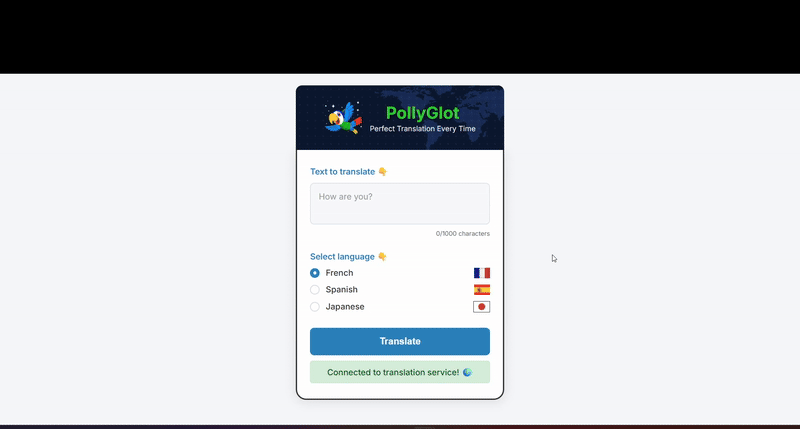

# PollyGlot Translator 🦜🌍

A modern, full-stack translation application powered by OpenAI's GPT models. PollyGlot provides instant, accurate translations with a beautiful, user-friendly interface.



## ✨ Features

- **🚀 Instant Translation**: Real-time translation powered by OpenAI GPT
- **🌐 Multiple Languages**: Support for French, Spanish, Japanese, and more
- **📱 Responsive Design**: Works perfectly on desktop and mobile devices
- **⚡ Fast & Reliable**: Express.js backend with optimized API calls
- **🎨 Modern UI**: Clean, intuitive interface with smooth animations
- **📋 Copy to Clipboard**: Easy one-click copying of translations
- **🔄 Real-time Feedback**: Loading states and error handling
- **📊 Character Counter**: Visual feedback for input length
- **🎯 High Accuracy**: Professional-grade translations using OpenAI Agents

## 🛠️ Tech Stack

### Frontend
- **HTML5** - Semantic markup
- **CSS3** - Modern styling with animations
- **Vanilla JavaScript** - ES6+ features
- **Responsive Design** - Mobile-first approach

### Backend
- **Node.js** - JavaScript runtime
- **Express.js** - Web application framework
- **OpenAI Agents** - AI-powered translation
- **CORS** - Cross-origin resource sharing
- **dotenv** - Environment variable management

## 🚀 Getting Started

### Prerequisites

- **Node.js** (v16 or higher)
- **npm** (comes with Node.js)
- **OpenAI API Key** ([Get it here](https://platform.openai.com/api-keys))

### Installation

1. **Clone the repository**
```bash
   git clone https://github.com/yourusername/pollyglot-translator.git
   npm install
   # Create .env file in project root
   echo "OPENAI_API_KEY=your-api-key-here" > .env
   npm start
```
**Made with ❤️ by [Mohammed Ashraf]**

*PollyGlot - Breaking down language barriers, one translation at a time! 🌍*
